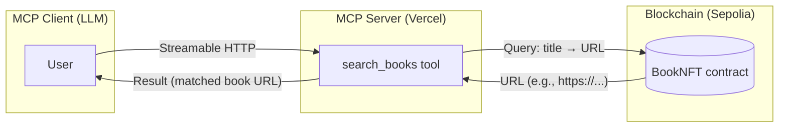

# mcp-server-for-ai-readers

## Overview

This repository is a demo application that proposes a way to provide "document location information" to AI agents.

- Contract: Stores the title of a document (book) and the URL where it can be obtained. This information is recorded on the blockchain as an NFT.
- Frontend: Acts as an MCP server. It receives a book title from the LLM host, queries the information stored on-chain, and returns the URL corresponding to the title.

(Although not implemented in this app), the goal is to utilize documents acquired by AI agents as reference materials during LLM execution.

### Motivation

As AI agents become more widely used, they will gather diverse information and present decision proposals. However, because they heavily rely on pre-trained LLM knowledge and information fetched from MCP servers, it becomes difficult for humans to verify the evidence behind those reports and proposals. There is also a risk of unintended bias in the data sources that agents use.

To address this, we aim to provide documents in formats that are also friendly to humans—such as books, magazines, and papers—so we can improve evidence traceability and mutual intelligibility. Just as people can freely read books at bookstores and libraries, AI should be able to freely and programmatically consult paid or free content. For this reason, this application records document metadata on the blockchain.

## Tech stack

### Frontend

- Next.js
- Vercel MCP Server Template  
  https://vercel.com/docs/mcp/deploy-mcp-servers-to-vercel

### Contract

- Hardhat
- OpenZeppelin (ERC‑721)

## System architecture

The diagram below illustrates the relationship between the MCP client, MCP server, and the blockchain in this system.



## Demo

### Live demo

#### Vercel
- https://mcp-for-next-js.vercel.app
- https://mcp-server-for-ai-readers.vercel.app/mcp

```bash
# Check MCP server response (Streamable HTTP client)
cd frontend/
node scripts/test-streamable-http-client.mjs https://mcp-server-for-ai-readers.vercel.app search_books '{"book_title":"book two"}'
```

#### Deployed contract
- Sepolia
  - BookNFTModule#BookNFT — 0x07BaD34F93032cfaD3432DdD1b1BdFC32DDddb7D
    https://sepolia.etherscan.io/address/0x07BaD34F93032cfaD3432DdD1b1BdFC32DDddb7D

#### MCP client setup

The MCP server can be used with MCP clients that support Streamable HTTP.  
Currently, it has only been verified with GitHub Copilot on VS Code. Please refer to `.vscode/mcp.json` and apply the settings to your workspace.

## Local development

### Frontend

```bash
cd frontend
cp .env.example .env
pnpm install
npm run dev

# In another terminal
node scripts/test-streamable-http-client.mjs http://localhost:3000 echo '{"message":"gm from cli"}'
node scripts/test-streamable-http-client.mjs http://localhost:3000 search_books '{"book_title":"book from cli"}'
```

#### Verify with MCP Inspector

```bash
cd frontend
npx @modelcontextprotocol/inspector

# Open the following URL
http://localhost:6274
```

### Contract

```bash
cd contract
cp .env.example .env
npm install
npx hardhat compile

# Deploy contract
npx hardhat ignition deploy ignition/modules/BookNFT.ts --network sepolia

# Add a book
npx hardhat addBook --network sepolia --title "Book Two" --url "https://example.com/book_two"

# Check book info
npx hardhat getBookTitles --network sepolia --tokenid 1
```

## Future work

After publishing document metadata on the blockchain, we need to create a virtuous cycle in which more valuable documents continue to be published. To that end, mechanisms that allow users to evaluate documents and provide feedback (e.g., reviews, ratings, reputation metrics) may be helpful.

In addition, when AI retrieves and uses files, it would be desirable to have a way to make voluntary donations or micropayments to content providers.