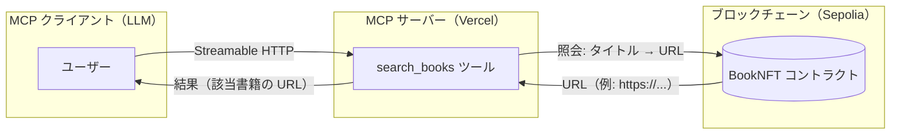

# mcp-server-for-ai-readers

## 概要

本リポジトリは、AI エージェントに「ドキュメントの所在情報（どこにあるか）」を提供する仕組みを提案するデモアプリです。

- コントラクト（contract）: ドキュメント（書籍）のタイトルと、その入手先を示す URL を保存します。これらの情報は NFT としてブロックチェーンに記録されます。
- フロントエンド（frontend）: MCP サーバーとして動作します。LLM ホストから書籍タイトルを受け取り、ブロックチェーン上に保存された対応情報を照会して、該当する書籍の URL を返します。

（このアプリでは実装されていませんが）AI エージェントが取得したドキュメントを LLM 実行時の参照資料として活用することをゴールとしています。

### 開発の動機

AI エージェントの利用が広がるにつれ、エージェントは多様な情報を収集し、それに基づく意思決定案を提示するようになるでしょう。  
一方で、エージェントは学習済み LLM の知識や MCP サーバーから取得した外部情報を多用するため、エージェントが作成したレポートや提案の根拠を人間が検証することが難しくなりがちです。さらに、使用するデータソースにユーザーの意図しない偏り（バイアス）が生じるおそれもあります。

この課題に対処するため、本・雑誌・論文といった「人間にとっても読みやすい形式」のドキュメントを AI に提供し、根拠の追跡性と相互理解性を高める——これが本アプリケーションの主な開発動機です。

人間が書店や図書館で自由に本を読めるように、AIも自由かつ機械的に有料または無料のコンテンツを参照するべきです。このため、本アプリケーションはドキュメントの情報をブロックチェーンに記録します。

## 使用技術

### Frontend

- Next.js
- Vercel MCP Server Template  
  https://vercel.com/docs/mcp/deploy-mcp-servers-to-vercel

### Contract

- Hardhat
- OpenZeppelin（ERC‑721）

## システム構成

以下は、本システムにおける MCP クライアント、MCP サーバー、ブロックチェーンの関係を示した構成図です。



## デモ

### ライブデモ

#### Vercel
- https://mcp-for-next-js.vercel.app
- https://mcp-server-for-ai-readers.vercel.app/mcp

```bash
# MCP サーバーのレスポンス確認（Streamable HTTP クライアント）
cd frontend/
node scripts/test-streamable-http-client.mjs https://mcp-server-for-ai-readers.vercel.app search_books '{"book_title":"book two"}'
```

#### デプロイ済みコントラクト
- Sepolia
  - BookNFTModule#BookNFT — 0x07BaD34F93032cfaD3432DdD1b1BdFC32DDddb7D
    https://sepolia.etherscan.io/address/0x07BaD34F93032cfaD3432DdD1b1BdFC32DDddb7D

#### MCP クライアント設定

MCP サーバーは、Streamable HTTP に対応した MCP クライアントで利用できます。  
現時点の動作確認は VS Code 上の GitHub Copilot のみです。設定は `.vscode/mcp.json` を参考に、ワークスペースへ適用してください。

## ローカル環境構築

### Frontend

```bash
cd frontend
cp .env.example .env
pnpm install
npm run dev

# 別ターミナルで
node scripts/test-streamable-http-client.mjs http://localhost:3000 echo '{"message":"gm from cli"}'
node scripts/test-streamable-http-client.mjs http://localhost:3000 search_books '{"book_title":"book from cli"}'
```

#### MCP Inspector での動作確認

```bash
cd frontend
npx @modelcontextprotocol/inspector

# 以下の URL にアクセス
http://localhost:6274
```

### Contract

```bash
cd contract
cp .env.example .env
npm install
npx hardhat compile

# コントラクトのデプロイ
npx hardhat ignition deploy ignition/modules/BookNFT.ts --network sepolia

# 書籍情報の追加
npx hardhat addBook --network sepolia --title "Book Two" --url "https://example.com/book_two"

# 書籍情報の確認
npx hardhat getBookTitles --network sepolia --tokenid 1
```

## 今後の発展

ブロックチェーン上にドキュメント情報を公開した後は、より価値の高いドキュメントが継続的に公開される循環を生み出す必要があります。そのためには、ユーザーがドキュメントを評価・フィードバックできる仕組み（例：レビュー、レーティング、レピュテーション指標）が有効かもしれません。

また、AI がファイルを取得・活用する際に、コンテンツ提供者へ任意の寄付やマイクロペイメントを行える仕組みがあると望ましいです。